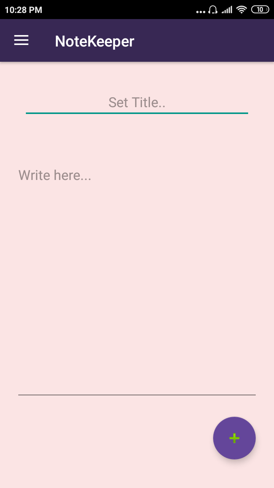
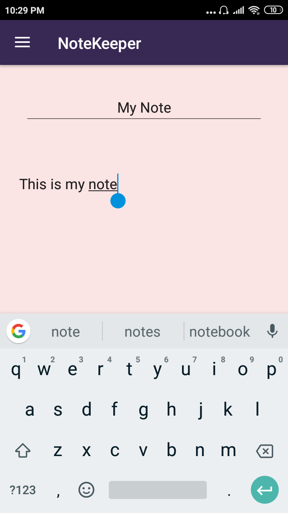
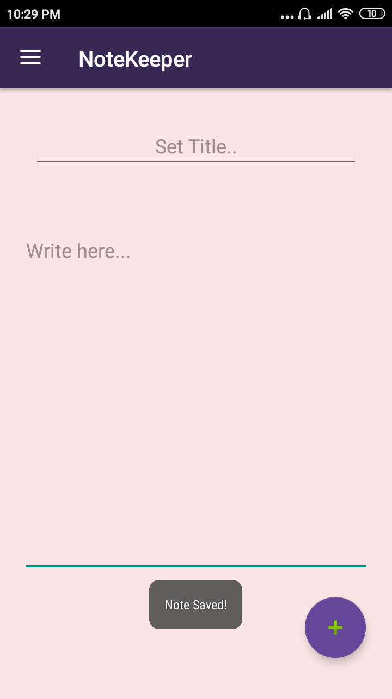
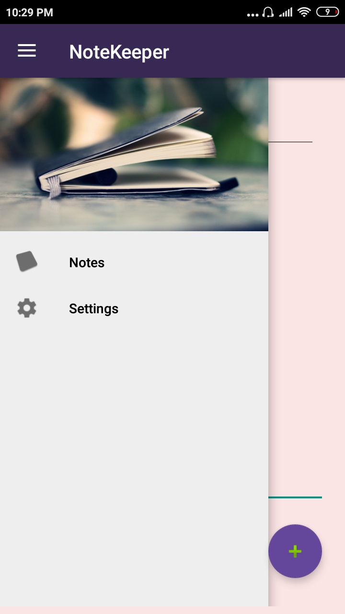
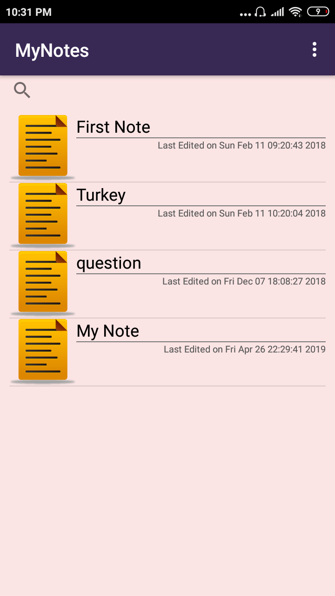
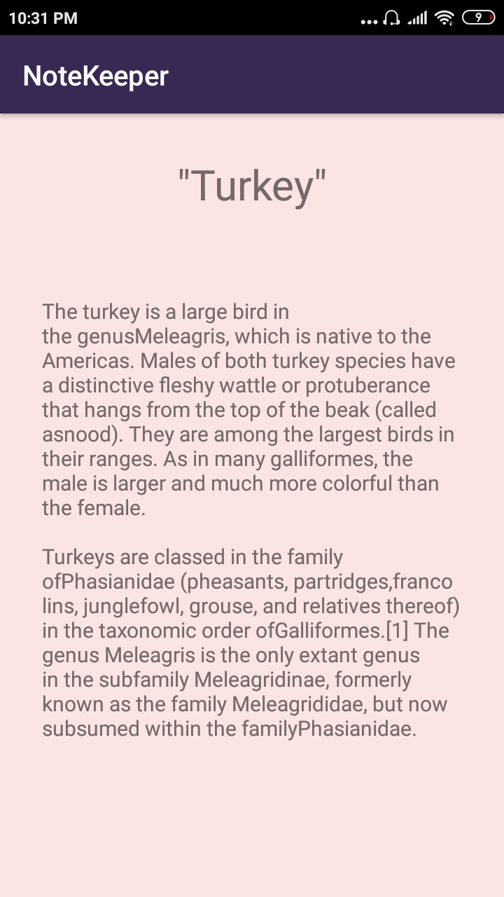
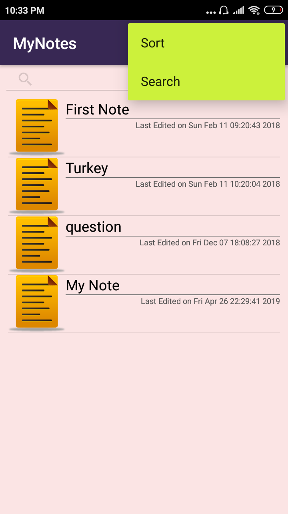
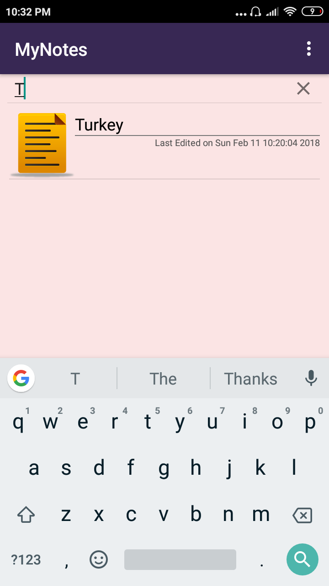
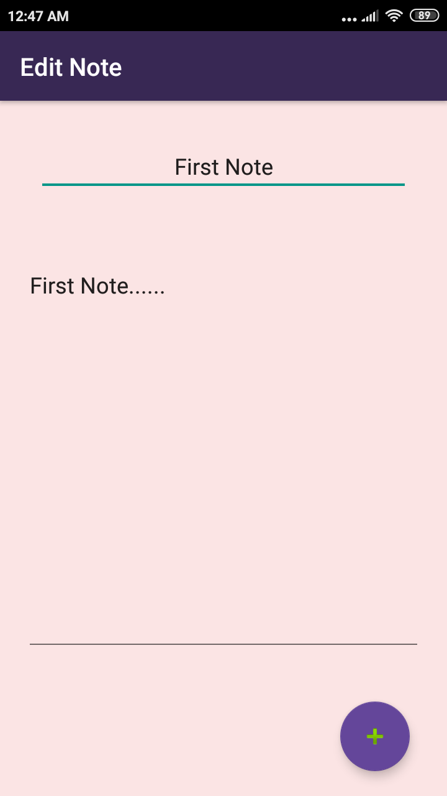
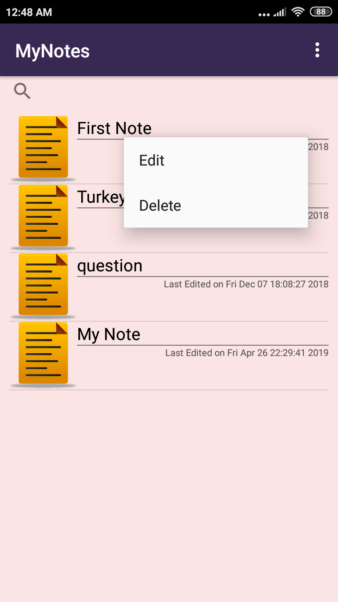

# Notetaker-App
This is an android application which saves notes made by the user for future viewing. 

### Tools:
* Android Studio

      

 

   
 

 

 

### Features:

* Write notes on subject of choice
* Save note
* View, Edit, Delete notes
* Search notes by name from note collection
* Organize notes in a sorted manner
* Date and time of note creation and note edit shown
